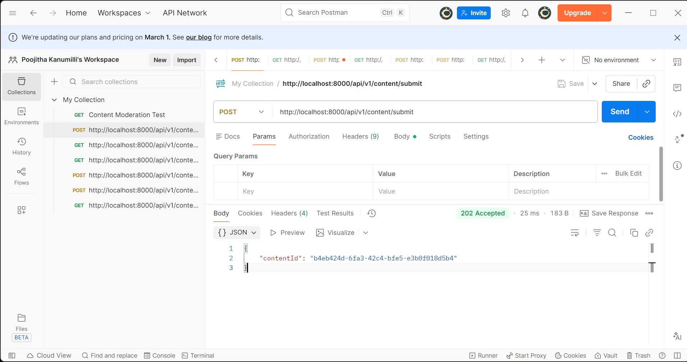
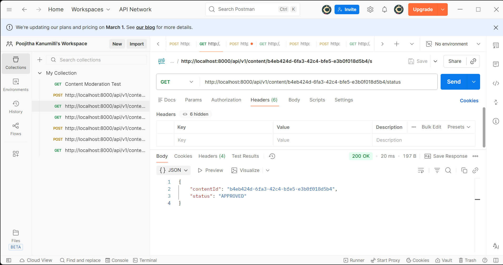
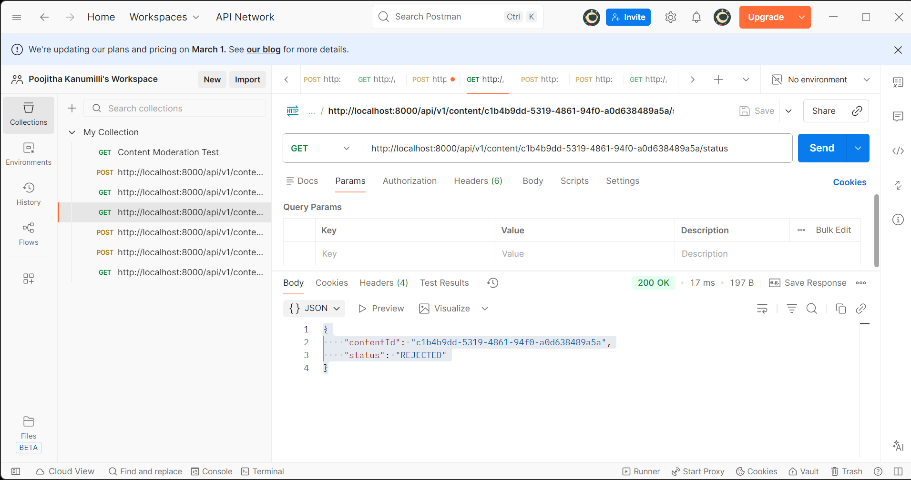
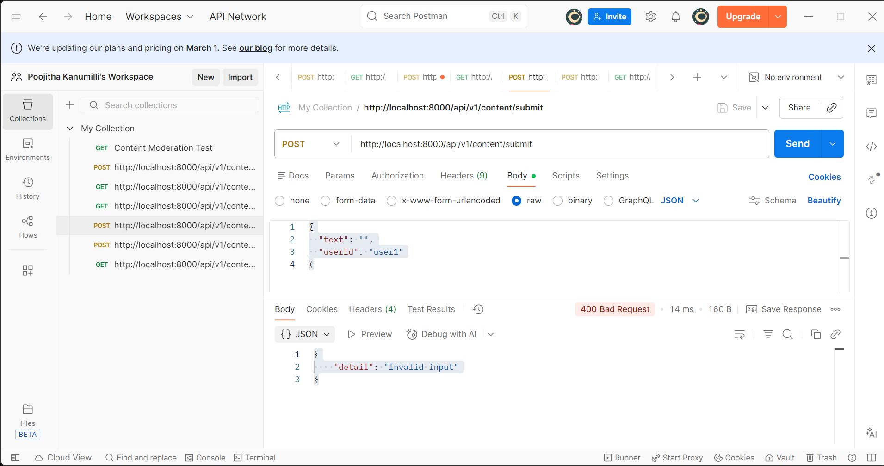
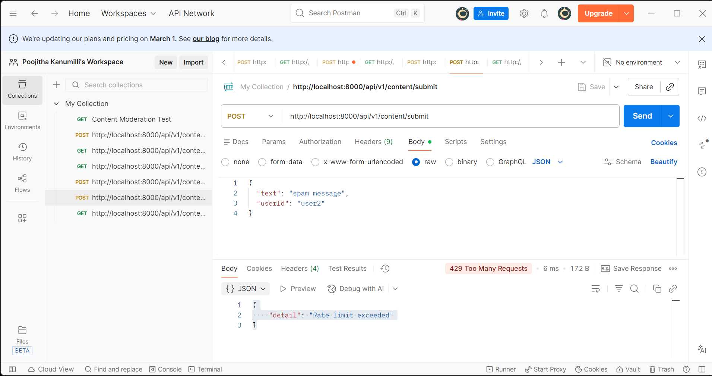
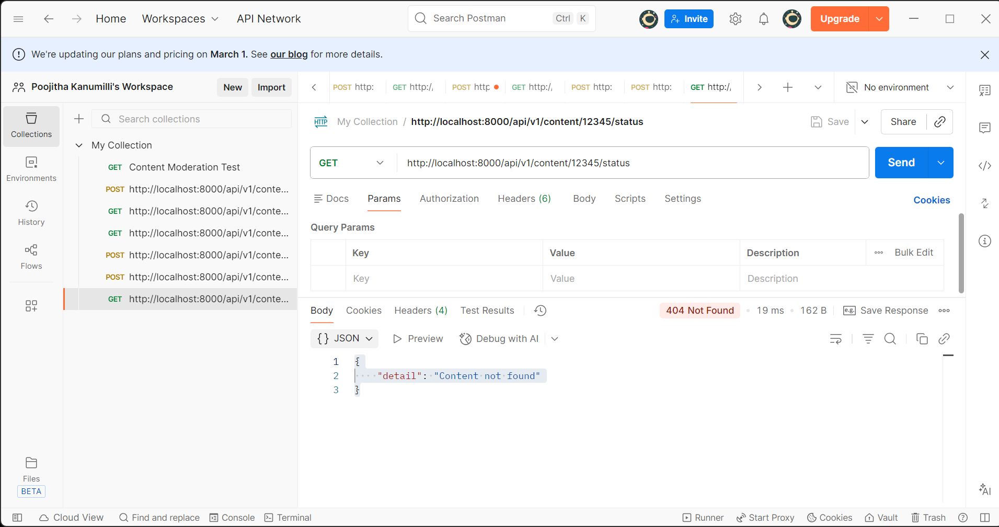
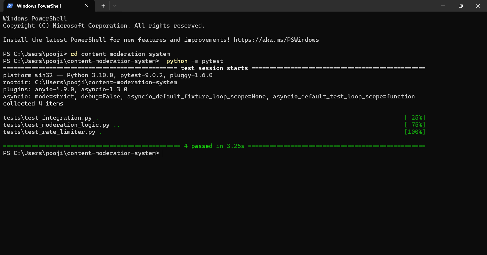

# Content Moderation Service with Dynamic Rate Limiting and Asynchronous Event Processing

## 📌 Project Overview

This project implements a scalable backend content moderation system using an event-driven architecture.  
The system provides an API for submitting user-generated content, applies per-user rate limiting, and processes moderation asynchronously using a message queue.

Two main services are implemented:
- **API Service**: Accepts content submissions, enforces rate limiting, stores data, and publishes moderation events.
- **Moderation Processor Service**: Consumes events from the message queue and simulates moderation logic (APPROVED/REJECTED).

The application is fully containerized using Docker and orchestrated with Docker Compose.

---

## 🏗 Architecture Overview

**Flow:**

1. Client sends content to API Service (`POST /api/v1/content/submit`)
2. API validates input and applies rate limiting
3. Content is stored in PostgreSQL with status `PENDING`
4. API publishes a `ContentSubmitted` event to Redis Pub/Sub
5. Moderation Processor consumes the event and processes content
6. Moderation result is stored in PostgreSQL
7. Client retrieves status using `GET /api/v1/content/{contentId}/status`

**Components:**
- FastAPI (API Service)
- PostgreSQL (Database)
- Redis (Message Queue)
- Python Worker (Moderation Processor)
- Docker & Docker Compose

---

## 📂 Project Structure

content-moderation-system/
├── src/
│ ├── api/
│ └── processor/
├── docker/
│ └── init.sql
├── tests/
├── docker-compose.yml
├── .env.example
├── README.md
└──API_DOCS.md

---

## ⚙️ Setup & Run Instructions

### Prerequisites
- Docker
- Docker Compose
- Python 3.10+
- Postman (optional for testing)

---

### 1️⃣ Clone Repository

```bash
git clone https://github.com/<your-username>/content-moderation-system.git
cd content-moderation-system

2️⃣ Start Services
docker-compose up --build


All services will start:

API: http://localhost:8000

PostgreSQL
Redis
Moderation Processor

3️⃣ Run Tests

In a new terminal:

python -m pytest


Expected output:
4 passed in X.XXs

🔌 API Endpoints
POST /api/v1/content/submit

Request Body:

{
  "text": "string",
  "userId": "string"
}


Responses:

202 Accepted → Content accepted
400 Bad Request → Invalid input
429 Too Many Requests → Rate limit exceeded

GET /api/v1/content/{contentId}/status

Response:

{
  "contentId": "uuid",
  "status": "PENDING | APPROVED | REJECTED"
}


Errors:
404 Not Found → Content not found

🧪 Testing

Unit tests for rate limiting logic
Unit tests for moderation logic
Integration tests for end-to-end workflow

🐳 Docker Compose Services

api
processor
database (PostgreSQL)
redis
Health checks ensure correct startup order.

🔐 Environment Variables

See .env.example for all environment variables. Key variables include:

- `DATABASE_URL` — Postgres connection string
- `REDIS_URL` — Redis connection string
- `RATE_LIMIT_PER_MINUTE` — Per-user rate limit
- `DB_MAX_RETRIES` — Number of connection retry attempts for Postgres (default 5)
- `DB_RETRY_BACKOFF_SEC` — Base backoff seconds for Postgres retry (default 1.0)
- `REDIS_MAX_RETRIES` — Number of connection retry attempts for Redis (default 5)
- `REDIS_RETRY_BACKOFF_SEC` — Base backoff seconds for Redis retry (default 0.5)
- `LOG_LEVEL` — Logging level (e.g., INFO, DEBUG)

📑 API Documentation

Detailed API documentation is available in:

API_DOCS.md

## 📬 Postman Testing

All API endpoints were tested using Postman.  
For this submission, request/response screenshots are provided in the `screenshots/` directory instead of a Postman collection export.

These screenshots demonstrate successful and error scenarios including:
- Valid content submission
- Approved and rejected moderation results
- Invalid input handling
- Rate limiting behavior
- Content not found errors


## 📸 API Testing Screenshots

### Submit Content (Success)



### Get Content Status (Approved)


### Get Content Status (Rejected)


### Invalid Input


### Rate Limit Exceeded


### Content Not Found


### Pytest Results



✅ Features Implemented

Dynamic per-user rate limiting (Token Bucket style)
Event-driven architecture using Redis Pub/Sub
Asynchronous moderation processing
Persistent storage with PostgreSQL
Dockerized microservices
Unit & integration testing
Error handling and validation
Retry/backoff and logging for DB and Redis connections

🚀 Future Improvements

Authentication (API Key / JWT)
Real ML-based moderation logic
Retry mechanism in processor
Circuit breaker
Monitoring & metrics

👩‍💻 Author
Poojitha